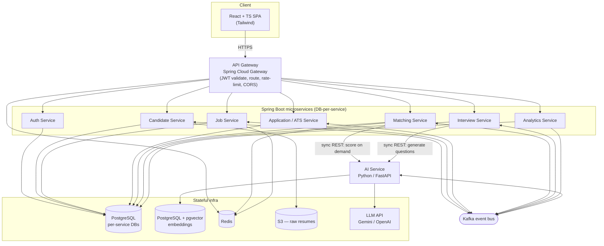
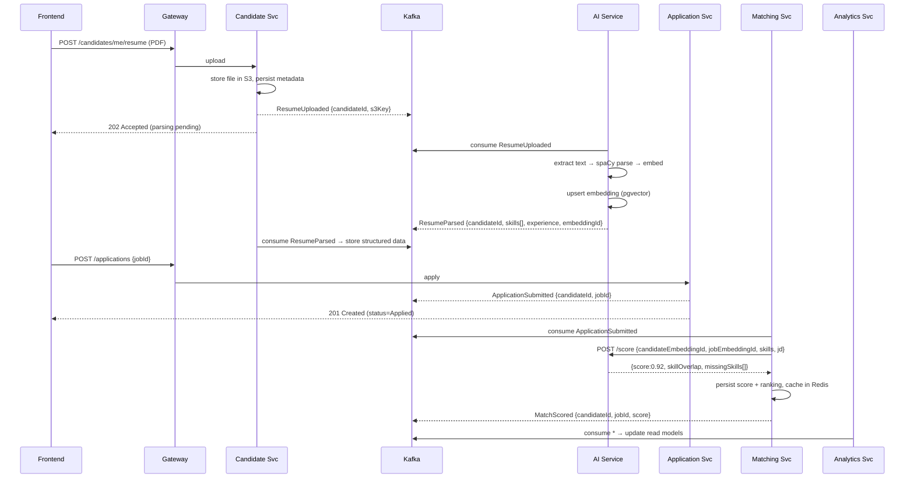
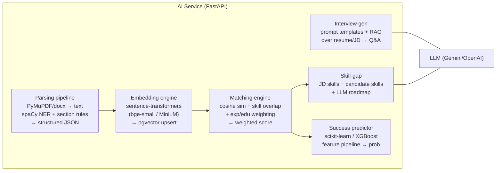

# Matchly — System Architecture

> Status: Design. Target stack as specified in the PRD: React/TypeScript,
> Spring Boot microservices, Python/FastAPI AI service, Kafka, PostgreSQL,
> Redis, Docker/Kubernetes, AWS.

## 1. Architecture principles

1. **Database per service.** Each service owns its schema; no cross-service table
   access. Data is shared via APIs (sync) or events (async). This is what makes
   independent deployment and scaling real rather than nominal.
2. **Synchronous for reads on the request path, asynchronous for heavy work.**
   User-facing reads (job lists, a candidate's match score) are sync REST and
   must be fast. Resume parsing, embedding, LLM generation, and ML scoring are
   slow and run off the request path via Kafka.
3. **The Java services orchestrate; the AI service computes.** Spring services
   own domain state, transactions, and business rules. The Python AI service is
   stateless compute (parsing, embeddings, similarity, LLM, ML) with its own
   PostgreSQL+pgvector for vectors and model metadata.
4. **Events are facts, not commands.** Topics carry past-tense domain events
   (`ResumeUploaded`, `ApplicationSubmitted`). Consumers decide what to do.
5. **Idempotency everywhere on the async path.** Every event handler is safe to
   replay; Kafka gives at-least-once delivery.
6. **Fail soft on AI.** If the AI service or an LLM is unavailable, the core
   recruitment workflow (post jobs, apply, move through pipeline) still works;
   AI outputs degrade to "pending" rather than blocking.

## 2. High-level component view



## 3. Service decomposition

| Service | Owns (data) | Responsibilities | Talks to |
|---|---|---|---|
| **API Gateway** | — | TLS termination, JWT validation, routing, rate limiting, CORS, request correlation IDs | all services, Redis |
| **Auth** | users, roles, refresh tokens, OAuth links | Registration/login, JWT issue/refresh, OAuth2 social/SSO, RBAC role assignment | — |
| **Candidate** | candidate profiles, resume files (metadata), parsed resume data, embeddings ref | Resume upload + storage (S3), profile CRUD, emits `ResumeUploaded`, stores parsed result | Kafka, S3 |
| **Job** | job postings, required-skills, JD text + embedding ref | Job CRUD, publish/close, emits `JobPosted/JobUpdated/JobClosed` | Kafka, Redis |
| **Application / ATS** | applications, pipeline stages, status history, recruiter comments, activity log | Apply to job, move stages (Applied→Screening→Shortlisted→Interview→Offer→Rejected), comments, audit trail | Kafka |
| **Matching** | match scores, candidate rankings, skill-gap results | Orchestrate AI matching, persist scores/ranks, serve "candidates for a job" and "match score" reads | AI (sync), Kafka, Redis |
| **Interview** | generated question sets | Request question generation from AI, persist, serve to recruiters | AI (sync), Kafka |
| **Analytics** | read models / aggregates | Consume all domain events, build dashboards (funnel, time-to-hire, conversion, in-demand skills), reports | Kafka |
| **AI Service** (Python) | embeddings (pgvector), ML models metadata | Resume parsing, embeddings, semantic matching, skill-gap, interview-question generation, success prediction | LLM, pgvector, Kafka |

> **Why an Application/ATS service (ADR-002):** an *application* is the join of a
> candidate and a job plus its own lifecycle (stages, comments, audit). Putting it
> in Candidate or Job would force one to reach into the other's domain. It earns
> its own bounded context.

## 4. Communication strategy — sync vs async

The PRD's NFRs force the split: **API response < 300 ms**, **resume processing
< 5 s**, **ranking accuracy > 85 %**. You cannot do parsing/embedding/LLM work
inside a 300 ms request. So:

**Synchronous (REST, on the request path, must be fast):**
- All CRUD and reads through the gateway.
- Matching → AI `/score` *only* for on-demand single-pair scoring of already-
  embedded inputs (vector lookup + cosine + skill overlap is sub-100 ms).
- Interview → AI `/interview/generate` is sync but slow (LLM, seconds); the
  frontend calls it explicitly and shows a spinner, or polls (see §5).

**Asynchronous (Kafka, off the request path):**
- Resume parsing + embedding (triggered by `ResumeUploaded`).
- Job embedding (triggered by `JobPosted`).
- Bulk re-ranking when a new candidate matches an open job (triggered by
  `ResumeParsed` + open jobs, or `ApplicationSubmitted`).
- Analytics ingestion (consumes everything).
- Success-prediction scoring (batch + on application).

### 4.1 Canonical flow — candidate applies, gets ranked



### 4.2 Why this meets the NFRs
- The user's `POST /resume` and `POST /applications` return in well under 300 ms
  because they only write + emit an event.
- "Resume processing < 5 s" is the async parse→embed pipeline measured from
  `ResumeUploaded` to `ResumeParsed`; it is not on a user request.
- Reading a match score is a cached/precomputed read → fast.

## 5. Long-running AI calls (interview generation)

LLM generation takes seconds and can't hide behind a fast sync call. Two
supported patterns:
- **Request/poll:** `POST /interviews` returns `202 {jobId, status:GENERATING}`;
  frontend polls `GET /interviews/{id}`. Simple, robust. **Default.**
- **WebSocket/SSE stream** (future): stream tokens for a live feel.

## 6. AI service internal architecture

The AI service is a single FastAPI app with clearly separated pipelines so they
can later be split into independent deployments if load demands it.



### 6.1 Matching score (how 0.92 is computed)
A transparent, tunable weighted blend — *not* a single opaque cosine number,
because recruiters need explainability and the PRD wants > 85 % accuracy:

```
final = w_sem * semantic_similarity      # cosine(resume_emb, jd_emb), 0..1
      + w_skill * skill_overlap          # |matched req skills| / |req skills|, taxonomy-normalized
      + w_exp * experience_fit           # candidate yrs vs required band
      + w_edu * education_fit            # degree level match
```
Default weights `w_sem=0.45, w_skill=0.35, w_exp=0.15, w_edu=0.05`, stored in
config and A/B-tunable. Skill matching normalizes synonyms via a skill taxonomy
(e.g. "JS" ≡ "JavaScript", "k8s" ≡ "Kubernetes") to avoid false gaps.

### 6.2 Success predictor (ML)
- **Target:** P(candidate is shortlisted), trained on historical
  application→outcome data (from Application Service via Analytics).
- **Features:** years of experience, skill-match count, certifications count,
  education level, project count, semantic score.
- **Models:** baseline RandomForest, primary XGBoost; track Accuracy / Precision
  / Recall / F1. Served behind `/predict`. Models versioned in a registry
  (MLflow or S3 + metadata table) so scores are reproducible.
- **Cold start:** until enough labeled data exists, fall back to the rule-based
  weighted score and clearly label predictions as heuristic.

## 7. Cross-cutting concerns

### 7.1 Identity & access (Auth)
- **JWT** access tokens (short-lived, ~15 min) + refresh tokens (rotating,
  stored hashed). Gateway validates the access token signature and expiry on
  every request and forwards claims (`sub`, `roles`, `tenantId`) as trusted
  headers to downstream services.
- **OAuth2** for social/SSO login (Google, LinkedIn) → mapped to internal users.
- **RBAC** roles: `CANDIDATE`, `RECRUITER`, `HIRING_MANAGER`, `ADMIN`. Enforced
  at the gateway (coarse: route access) and in each service (fine: method-level
  `@PreAuthorize`).
- **Service-to-service:** internal calls authenticated via mTLS (service mesh) or
  short-lived signed internal tokens; the AI service is not internet-exposed.

### 7.2 API Gateway
Spring Cloud Gateway: routing, JWT validation, per-user/IP rate limiting
(Redis token bucket), CORS, request size limits (resume uploads capped), and
injection of a `X-Correlation-Id` propagated through services and into Kafka
headers for end-to-end tracing.

### 7.3 Caching (Redis)
| Use | Key shape | TTL |
|---|---|---|
| Rate limiting | `rl:{userId}:{route}` | sliding window |
| JWT refresh-token denylist | `denylist:{jti}` | until token expiry |
| Job listing cache | `job:list:{filtersHash}:{page}` | 60 s |
| Match score cache | `match:{candidateId}:{jobId}` | 1 h, busted on re-score |
| Event idempotency keys | `idemp:{consumer}:{eventId}` | 24 h |
| Hot analytics aggregates | `ana:funnel:{jobId}` | 5 min |

### 7.4 Resilience
- Circuit breakers (Resilience4j) around AI/LLM calls with timeouts and
  fallbacks ("score pending").
- Kafka consumers: at-least-once + idempotent handlers + dead-letter topics for
  poison messages.
- Bulkheads so a slow LLM doesn't exhaust threads serving fast reads.

### 7.5 Observability
- **Metrics:** Micrometer → Prometheus; FastAPI via `prometheus_client`. Grafana
  dashboards per service + an SLO board (latency p99, error rate, Kafka lag).
- **Tracing:** OpenTelemetry across gateway → services → AI, correlation IDs in
  Kafka headers; export to Tempo/Jaeger.
- **Logging:** structured JSON logs → Loki/ELK, keyed by correlation ID.
- **Key SLO alarms:** API p99 > 300 ms, parse time > 5 s, Kafka consumer lag,
  AI/LLM error rate, model drift (prediction distribution shift).

### 7.6 Security
- All file uploads scanned (type/size validation, AV scan) before storage.
- PII (resumes, contact info) encrypted at rest (S3 SSE, RDS encryption) and in
  transit (TLS everywhere); field-level encryption for the most sensitive PII.
- Secrets in AWS Secrets Manager / SSM, never in images or env files.
- LLM prompts sanitized; resume content is untrusted input → guard against
  prompt injection in the interview/roadmap generators (instruction/role
  separation, output validation).
- Audit log (Application Service activity log) is append-only.

## 8. Deployment topology

- **Local dev:** `docker-compose` brings up PostgreSQL, Redis, Kafka (KRaft mode,
  no ZooKeeper), and the services. AI service runs with CPU models.
- **AWS (prod):** EKS (Kubernetes) for all services; RDS PostgreSQL (one instance
  per service or schema-per-service to start, split later); ElastiCache Redis;
  MSK (managed Kafka); S3 for resumes; ECR for images; ALB ingress. AI service
  on a GPU-optional node group if model latency requires it.
- **K8s:** kustomize base + `dev/staging/prod` overlays; HorizontalPodAutoscalers
  on the gateway, matching, and AI services (the load-sensitive ones);
  PodDisruptionBudgets; readiness/liveness probes.
- **CI/CD:** GitHub Actions — build/test/scan per service, push to ECR, deploy
  via kustomize/ArgoCD. Trunk-based with per-service pipelines (monorepo,
  path-filtered).

## 9. Architecture Decision Records (ADRs)

**ADR-001 — Monorepo, polyglot.** One repo with path-filtered CI. Rationale:
shared event-schema source of truth, atomic cross-service contract changes,
simpler onboarding. Trade-off: tooling must scope builds per path.

**ADR-002 — Dedicated Application/ATS Service.** See §3. The ATS aggregate spans
candidate↔job with its own lifecycle; it gets its own bounded context rather
than being wedged into Candidate or Job.

**ADR-003 — pgvector instead of a dedicated vector DB.** The PRD names PostgreSQL
and requires semantic search. pgvector keeps embeddings in the AI service's
PostgreSQL with HNSW indexing — adequate at expected volume and avoids operating
a second datastore (Pinecone/Weaviate/Milvus). Revisit if vector count or QPS
outgrows it.

**ADR-004 — Matching is a weighted, explainable blend, not raw cosine.** See
§6.1. Recruiters need to justify rankings and the PRD targets > 85 % accuracy;
opaque single-number similarity isn't tunable or defensible.

**ADR-005 — Heavy AI work is event-driven, not request-blocking.** See §4. The
only way to hold API p99 < 300 ms while parsing/embedding/LLM take seconds.

**ADR-006 — Fail-soft AI.** See principle 6. Core recruiting must function when
AI/LLM is degraded; AI outputs render as "pending"/heuristic, never as hard
request failures.

## 10. NFR / success-metric traceability

| PRD success metric | How the architecture delivers it |
|---|---|
| Resume processing < 5 s | Async parse+embed pipeline (§4.1); measured `ResumeUploaded`→`ResumeParsed`; horizontally scalable AI workers. |
| Ranking accuracy > 85 % | Weighted explainable score + skill taxonomy + ML predictor with tracked P/R/F1 (§6). |
| API response < 300 ms | Heavy work off request path; reads cached in Redis; gateway + DB-per-service (§4, §7.3). |
| 99.9 % availability | EKS multi-AZ, HPA, circuit breakers, DLQ, fail-soft AI (§7.4, §8). |
| Screening time −70 % | Auto-rank + skill-gap + auto interview questions remove manual filtering (Features 2–4). |

## 11. Top risks (summary; full register in ROADMAP.md)

1. **Resume parsing accuracy** on messy/varied PDF layouts — the quality of
   everything downstream depends on it.
2. **Matching accuracy / bias** — must be measured against labeled data and
   audited for fairness (legal exposure in hiring).
3. **LLM cost & latency** for interview/roadmap generation at scale.
4. **Operational weight** — Kafka + 8 services + AI is a lot to run; the roadmap
   deliberately defers full polyglot infra until a working slice exists.
