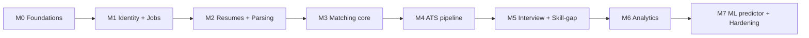

# Matchly — Delivery Roadmap

> Sequencing philosophy: **prove the core loop on a thin slice before standing up
> the full polyglot infrastructure.** The PRD's target stack (8 services + Kafka
> + K8s + AWS) is the *destination*, not where you start coding. Each milestone
> ends in something runnable and demoable, and adds operational weight only once
> it pays for itself. Estimates assume a small team (≈2 backend, 1 frontend, 1
> ML, shared DevOps); adjust to your reality.

## Milestone map

---

### M0 — Foundations & walking skeleton  ·  ~2 weeks
**Goal:** one request flows end-to-end through the full topology with nothing
business-meaningful yet, so the hard infra is proven early.
- Monorepo, CI (build/test/scan, path-filtered), code style, commit hooks.
- `docker-compose`: PostgreSQL, Redis, Kafka (KRaft), API Gateway, one stub
  Spring service, the FastAPI AI service stub.
- Shared `libs/java-common` (error model, correlation-id filter, security
  scaffolding) and `libs/schemas` (event envelope).
- Observability baseline: Prometheus + Grafana + structured logs + a trace that
  spans gateway → service → AI.
- **Exit criteria:** `GET /api/v1/health` traverses gateway → service → AI and
  shows one trace; `docker-compose up` boots the whole stack; CI green.

### M1 — Identity & Jobs  ·  ~2 weeks
**Goal:** real users and job postings; the recruiter can create and publish a job.
- Auth Service: register/login/refresh, JWT, RBAC, gateway JWT validation.
- Job Service: job CRUD + publish/close + `JobPosted` event.
- Frontend: auth flows, recruiter "create/publish job", candidate "browse jobs".
- **Exit criteria:** recruiter logs in, posts a job, candidate sees it; RBAC
  blocks a candidate from posting; `JobPosted` lands on Kafka.
- **Depends on:** M0.

### M2 — Resumes & parsing pipeline  ·  ~3 weeks  · *highest technical risk*
**Goal:** upload a resume, get accurate structured data back within 5 s.
- Candidate Service: profile + resume upload to S3 + `ResumeUploaded`.
- AI Service parsing pipeline: PyMuPDF/docx extraction → spaCy NER + section
  rules → structured JSON; embedding engine → pgvector; emits `ResumeParsed`.
- Candidate Service consumes `ResumeParsed`, persists structured data.
- Skill taxonomy seeded (canonical skills + aliases).
- Build a **parsing accuracy harness** against a labeled resume set early.
- **Exit criteria:** P50 parse < 5 s; field-extraction accuracy meets an agreed
  bar on the test set; embeddings stored and queryable.
- **Depends on:** M1. **Risk:** R1 (parsing accuracy).

### M3 — Matching core  ·  ~3 weeks
**Goal:** the headline feature — ranked candidates and a defensible match score.
- AI `/score`: weighted blend (semantic + skill overlap + exp + edu) with
  taxonomy normalization; skill-gap computation.
- Matching Service: orchestrate scoring, persist `match_scores`, Redis-cached
  rankings, `MatchScored` event; rescore endpoint.
- Job embedding on `JobPosted` (`JobEmbedded`).
- Frontend: recruiter "candidates for this job" ranked view + score breakdown.
- **Accuracy evaluation harness** vs. labeled relevance judgments → tune weights.
- **Exit criteria:** ranking accuracy ≥ 85 % on the eval set; score breakdown
  visible and explainable; rank read < 300 ms (cached).
- **Depends on:** M2. **Risk:** R2 (matching accuracy/bias).

### M4 — ATS pipeline  ·  ~2 weeks
**Goal:** manage candidates through the hiring funnel.
- Application/ATS Service: apply, stage transitions, comments, append-only
  activity log; `ApplicationSubmitted`/`StageChanged` events.
- Matching consumes `ApplicationSubmitted` → auto-score on apply.
- Frontend: recruiter kanban board (drag across stages), candidate "my
  applications" tracking view.
- **Exit criteria:** candidate applies → appears on board scored; recruiter moves
  stages with full audit trail; candidate sees live status.
- **Depends on:** M3.

### M5 — Interview generation & skill-gap UX  ·  ~2 weeks
**Goal:** AI assists evaluation and gives candidates feedback.
- Interview Service + AI `/interview/generate` (LLM, async request/poll);
  versioned prompts; technical/behavioral/scenario categories.
- Skill-gap surfaced to candidates with LLM learning roadmap.
- Prompt-injection hardening on resume-derived LLM inputs.
- **Exit criteria:** recruiter generates a question set per candidate/job;
  candidate sees missing skills + roadmap; LLM failures degrade gracefully.
- **Depends on:** M3 (skills/JD), M4 (per-application context).

### M6 — Recruiter analytics  ·  ~2 weeks
**Goal:** data-driven recruiting dashboards.
- Analytics Service consumes all domain events → funnel, time-to-hire,
  conversion, in-demand skills read models; report export.
- Frontend dashboard.
- **Exit criteria:** dashboards reconcile against source-of-truth services within
  tolerance; funnel/time-to-hire/skills all populated from live events.
- **Depends on:** M1–M5 (needs events flowing).

### M7 — ML success predictor & production hardening  ·  ~3 weeks
**Goal:** predictive scoring + production readiness.
- Train RandomForest/XGBoost success predictor on accumulated application
  outcomes; track Accuracy/Precision/Recall/F1; model registry + versioning;
  serve `/predict`; cold-start fallback to heuristic.
- Hardening: HPA/PDB, circuit breakers + DLQs verified, load test to NFR
  targets, security review, AWS (EKS/RDS/MSK/ElastiCache) via Terraform, CI/CD
  to staging→prod, runbooks + alerts.
- **Exit criteria:** all PRD success metrics measured and met (see checkpoints);
  prod deploy from CI; on-call runbook exists.
- **Depends on:** M6 (needs labeled outcome data volume).

---

## Critical path & parallelism
- **Critical path:** M0 → M1 → M2 → M3 → (M4, M5) → M6 → M7. M2 (parsing) and M3
  (matching) are the riskiest and gate the product's value — protect their
  schedule.
- **Can run in parallel:** frontend work trails each backend milestone by a sprint;
  ML data work (taxonomy, eval harnesses) starts in M2 even though the predictor
  ships in M7; DevOps/Terraform for AWS can be built out during M4–M6 ready for M7.

## Success-metric checkpoints (from PRD §11)
| Metric | Verified at | How |
|---|---|---|
| Resume processing < 5 s | M2 | Parse-pipeline latency P50/P95 in Grafana. |
| Ranking accuracy > 85 % | M3 | Offline eval harness vs. labeled judgments. |
| API response < 300 ms | M3, M7 | Gateway p99 dashboards + load test. |
| 99.9 % availability | M7 | Chaos/load test, multi-AZ, DLQ/circuit-breaker drills. |
| Screening time −70 % | M5+ | Recruiter time-on-task study (auto-rank + auto-questions). |

## Risk register
| ID | Risk | Impact | Likelihood | Mitigation |
|---|---|---|---|---|
| R1 | Resume parsing inaccurate on varied layouts | High (poisons everything downstream) | High | Labeled test harness from M2; spaCy + rules hybrid; manual-correction UI; track field accuracy as a release gate. |
| R2 | Matching inaccurate or biased | High (bad hires, legal exposure) | Med | Explainable weighted score; eval harness; fairness audit (no protected-attribute leakage); recruiter-in-the-loop, never auto-reject. |
| R3 | LLM cost/latency at scale | Med | Med | Async generation; cache by (candidate,job,prompt-version); cap/rate-limit; smaller model for drafts. |
| R4 | Operational weight (8 svc + Kafka + K8s) overwhelms team | High | Med | Walking skeleton first (M0); defer AWS/K8s to M7; strong local docker-compose; per-service path-filtered CI. |
| R5 | Hiring-data PII / compliance (GDPR, EEOC) | High | Med | Encryption at rest/in transit; data-retention & deletion policy; audit log; access controls; legal review before prod. |
| R6 | Prompt injection via resume content | Med | Med | Treat resume text as untrusted; instruction/role separation; output validation in interview/roadmap generators. |
| R7 | Cold-start for ML predictor (no labels yet) | Med | High (early) | Heuristic fallback labeled as such until enough outcome data; predictor ships in M7 by design. |

## Definition of Done (every milestone)
Tests (unit + the relevant integration/contract tests) green in CI · API
contracts documented and matching `API_CONTRACTS.md` · events conform to
`libs/schemas` · dashboards/alerts updated · demoable on the shared environment ·
no new high/critical security findings.
